<p align="center">
  
</p>

# OAHL — MCP for hardware (connect any AI agent to any physical device)

<p align="left">
  <a href="https://github.com/fredabila/oahl/stargazers"></a>
  <a href="https://opensource.org/licenses/MIT"></a>
  <a href="https://www.npmjs.com/package/@fredabila/oahl"></a>
  <a href="https://github.com/fredabila/oahl/graphs/contributors"></a>
  <a href="https://github.com/fredabila/oahl/commits/main"></a>
</p>

<p align="center">
  <br/>
  
  <br/>
  <em><strong>Demo</strong>: AI agent discovering a TECNO phone, reserving it, executing an ADB command, and getting results back.</em>
  <br/><br/>
</p>

## Why OAHL?
- AI agents can call APIs and write code, but they can't reliably control physical hardware.
- Every hardware integration today is bespoke, brittle, and non-composable.
- OAHL gives agents a standard lifecycle: **discover → reserve → execute → release**.
- One protocol for Android phones, cameras, SDR radios, sensors, robots, and anything with a transport plugin.

## Quick Start
You don't need to write any code to connect common hardware.

```bash
# 1. Install globally
npm install -g @fredabila/oahl

# 2. Run the interactive setup
oahl init

# 3. Start the node
oahl start
```

## Features
- **Hardware Abstraction:** Expose any physical device as standardized Capabilities to AI Agents.
- **Access Policies:** Declarative policies to strictly regulate which agent can use which device.
- **Session Exclusivity:** Ensure multiple AI agents don't conflict using device reservations.
- **Transport Plugins:** Native support for Serial (UART/USB), ADB, MQTT, TCP/IP, and more.
- See the [API Reference](docs/api-reference.md) and [Security Guide](docs/security-guide.md).

## Registry
- Visit **[registry.oahl.dev](https://registry.oahl.dev)** — discover and share hardware capabilities, adapters, and transport plugins.

## Research Paper
- Read the full technical paper: **[Open Agent Hardware Layer: A Protocol for AI-Hardware Interoperability](docs/oahl-protocol-v1.md)** 
-  *(System Topology Diagram)*

## Contributing
- See **[CONTRIBUTING.md](CONTRIBUTING.md)** for step-by-step setup instructions, development workflow, and adaptation guides.
- Ready to help? Check out our list of **["good first issues"](docs/good_first_issues.md)** to get started!

## Community
- [Join our Discord](#)
- [Follow us on X/Twitter](#)

---

## SDKs & Documentation

### Official SDKs
- **[JavaScript/TypeScript SDK](./packages/sdk-js)** ([@oahl/sdk](https://www.npmjs.com/package/@oahl/sdk))
- **[Python SDK](./sdk-python)** ([oahl](https://pypi.org/project/oahl/))

### Further Reading
See the `docs/` folder for:
- [Architecture Overview](docs/architecture.md)
- [Hardware Owner Guide](docs/hardware-owner-guide.md)
- [Adapter Guide](docs/adapter-guide.md)
- [Agent Integration Guide](docs/agent-integration-guide.md)
- [W3C WoT Alignment](docs/wot-alignment.md)

## Cloud Infrastructure
The `@oahl/cloud` package contains the hosted infrastructure that connects agents and nodes. When your node starts up, it securely registers itself with the Cloud Registry. AI Agents connect to this Cloud Registry (not your node directly) to request access to capabilities.

## Frequently Asked Questions (FAQ)

<details>
<summary><strong>Why should I use Docker instead of running via npm start?</strong></summary>

Docker is highly recommended because it **avoids host machine pollution**. Many hardware adapters (especially those communicating over serial or BLE) require native C++ bindings to be compiled during installation (e.g., `serialport`).

If you use `npm start`, you may need to install heavy dependencies like Visual Studio C++ Build Tools or `python`/`make` on your host machine. By using Docker, the node runs in a pre-configured Linux container with all build tools already installed.
</details>

<details>
<summary><strong>Can I run OAHL completely offline / locally without the Cloud Registry?</strong></summary>

**Yes, absolutely.** The Cloud Registry is strictly optional and used for global discovery. To run a 100% private, local-only node, simply open your `oahl-config.json` file and remove or empty the `cloud_url` property.
</details>

<details>
<summary><strong>Is it secure to let an AI control my hardware?</strong></summary>

OAHL is designed specifically to make this safe:
1. **Container Sandboxing:** Hardware runs in isolated Docker containers; the agent cannot access the host machine's filesystem.
2. **Access Policies:** You write a declarative policy for every device outlining exactly which capabilities an agent is allowed to execute (and you can ban specific agents/organizations).
3. **Session Exclusivity:** An agent must request a "session" to use a device. While an agent holds a session, no other agent can interrupt or send contradictory commands to your hardware.
</details>

---
Copyright © 2024–2026 Fred Abila and the OAHL Contributors.
